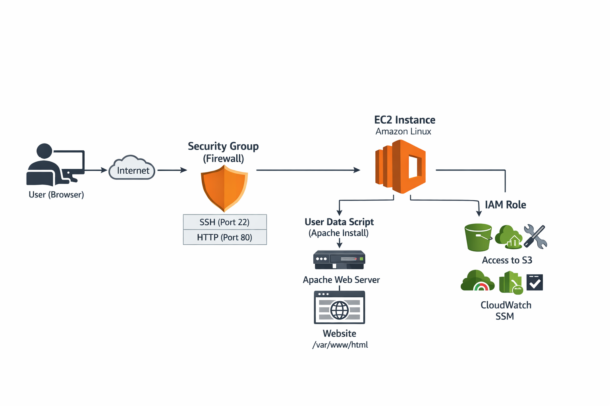
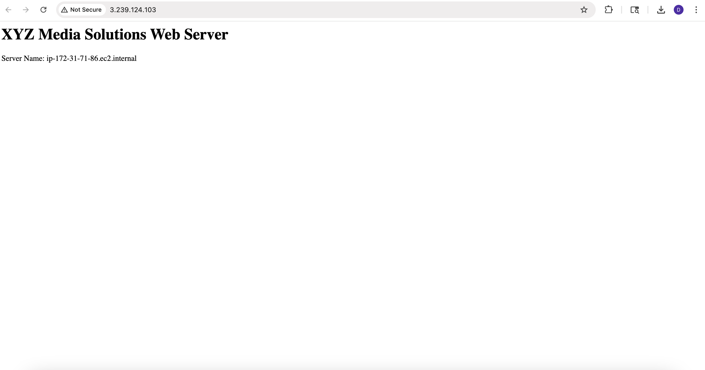
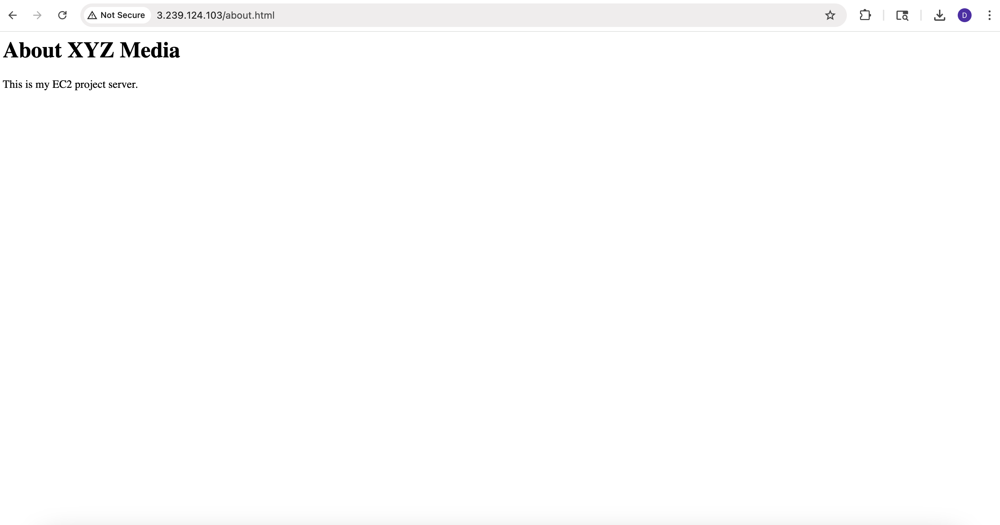

# 🚀 Automated Web Server Deployment on AWS EC2

## 📌 Project Overview
I built and deployed a web server on AWS EC2 using Amazon Linux and Apache.

The goal of this project was to simulate a real-world scenario where a company moves its website to the cloud with proper security and basic automation.

This project is not just about deployment — I also handled a situation where the website stopped working and had to troubleshoot and fix the issue.

---

## 🧠 Problem Statement
XYZ Media Solutions wanted to move their website to the cloud to improve availability and reduce infrastructure management.

---

## 📂 Project Files
- [Commands Used](commands.md)
- [User Data Script](user-data.sh)
- [Troubleshooting Details](troubleshooting.md)

---

## 🏗️ Architecture


The setup includes:
- User accessing the website over the internet  
- Security Group acting as a firewall (SSH + HTTP)  
- EC2 instance running Amazon Linux  
- Apache web server installed using User Data  
- IAM role for secure AWS service access  

---

## ⚙️ Deployment Steps
1. Launched EC2 instance (Amazon Linux, t3.micro)
2. Configured Security Group:
   - SSH (22) → My IP  
   - HTTP (80) → Anywhere  
3. Attached IAM Role:
   - AmazonS3ReadOnlyAccess  
   - AmazonSSMManagedInstanceCore  
   - CloudWatchAgentServerPolicy  
4. Added User Data script to install Apache automatically  
5. Connected to EC2 via SSH  
6. Hosted website in `/var/www/html`  

---

## 🔐 Security Implementation
- Restricted SSH access to my IP  
- Allowed HTTP access for public users  
- Used IAM Role instead of storing access keys  
- Followed least privilege principle  

---

## ⚡ Automation (User Data)
```bash
#!/bin/bash
yum update -y
yum install -y httpd
systemctl start httpd
systemctl enable httpd
echo "<h1>XYZ Media Solutions Web Server</h1>" > /var/www/html/index.html
echo "<p>Server Name: $(hostname -f)</p>" >> /var/www/html/index.html

---

## 🌐 Website Output


---

## 📄 About Page


---

## 🧪 Troubleshooting Incident

### What happened?
At one point, the website stopped loading even though the EC2 instance was still running.

### How I debugged it:
- Checked EC2 instance status → it was running  
- Verified security group → HTTP was allowed  
- Checked Apache service → found it was stopped  
- Checked port 80 → nothing was listening  

### Root Cause
Apache web server was not running.

### Fix
Restarted Apache using:

```bash
sudo systemctl start httpd
